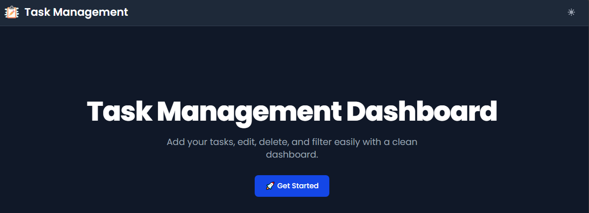
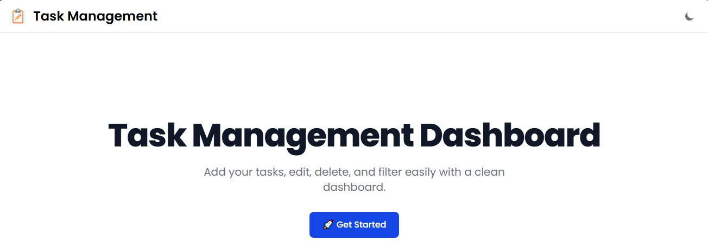
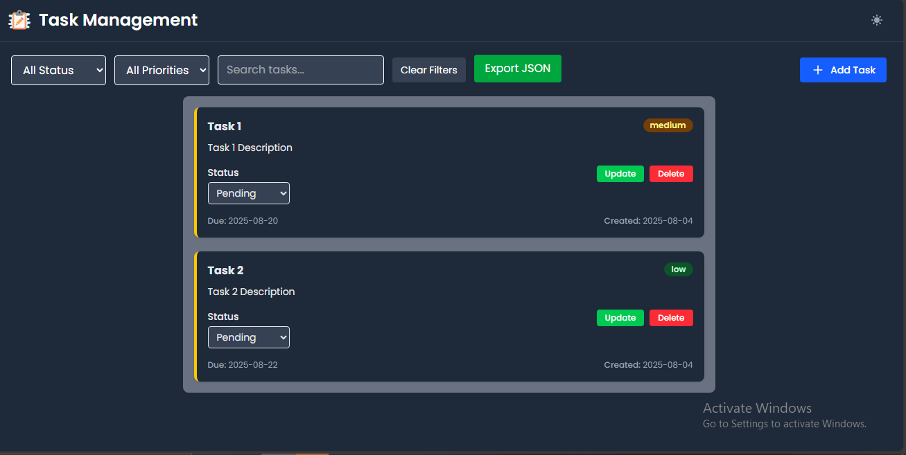

## Task Management Dashbord

```markdown
# Task Management Dashboard
# 🚀 Features
✅ Add, Edit, Delete Tasks
✅ Filter by Status & Priority
✅ Search by Title or Description
✅ Drag & Drop Reordering (powered by @dnd-kit/core)
✅ Dark Mode Ready (TailwindCSS)
✅ Export Tasks as JSON
✅ Responsive UI







## Setup

1. Clone the repository
2. Run `npm install`
3. Run `npm start`
4. Open http://localhost:3000
